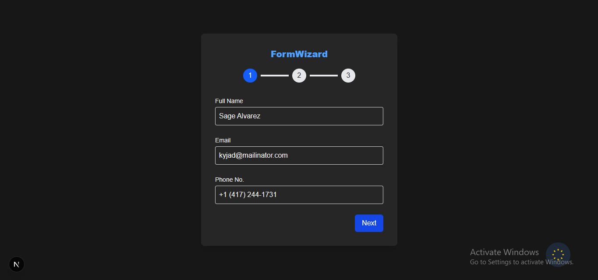

# Multi-Step Form Wizard with Validation

A modern multi-step form implementation with robust validation, dark mode support, and seamless navigation. Built with Next.js, TypeScript, and Tailwind CSS.

 <!-- Add your screenshot -->

## Features

- 🪄 3-Step form wizard with progress indicator
- 🔒 Zod validation with real-time error handling
- 🌓 Dark/Light mode toggle
- 📱 Mobile-responsive design
- 📡 API simulation with React Query
- 🛠 Type-safe implementation
- 🎨 Modern UI with Tailwind CSS

## Installation

1. **Clone the repository**

```bash
git clone https://github.com/<your-username>/<repository-name>.git
```

2. **Navigate to project directory**

```bash
cd form-wizard
```

3. **Install dependencies**

```bash
pnpm install / npm install
```

4. **Run development server**

```bash
pnpm dev
```

4. **Open in browser**

```bash
Visit http://localhost:3000 in your browser
```
